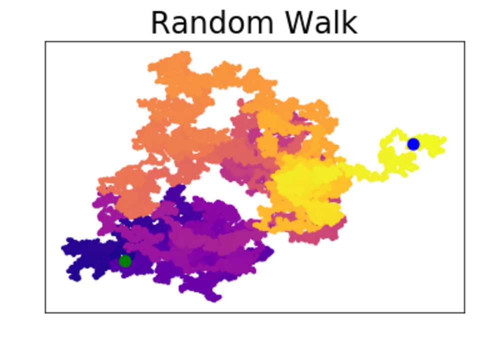

# DataVisualization
Using Python with matplotlib, Pygal, json, and Requests libraries to access an API and visualize the data in a useful format.

Project inspired by: Python Crash Course by Eric Matthes

Here is an [example](./PracticeVisualizations/Random_Walk.ipynb) of using matplotlib to visualize a random walk of 25,000 points:

Here is an [example](./PracticeVisualizations/Simple_Scatter_Plot.ipynb) of using matplotlib to visualize the cubes of numbers from 1 to 5000:
